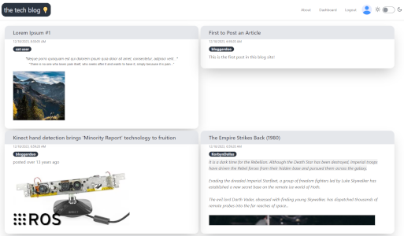

# The Tech Blog 💡


## Description

This is a tech blog site demonstrating:
- ORM (Object-Relational Modelling) using sequelize to manage database objects as Javascript objects
- MVC (Model-View-Controller) to build websites off dynamic content using handlebar templates


## Install

1. `$ git clone https://github.com/andrenrwn/techblog`

2. Configure your environment variables, database name, user, password, and API keys in .env
   `$vi .env`

3. `$ npm install`

4. Ensure the database is created in mysql
   `$ mysql -u root -p < db/schema.sql`

5. `$ node seeds/seed.js`

6. `$ nodemon server.js`

7. Browse to `https://localhost:3001/`


## Usage



#### Reading articles
- The homepage is accessible by clicking the main title "the tech blog"
- Browse to the website's home page.
- The home page shows the articles, the most recent on top
- Clicking an article renders the article on its own page

#### Editing articles
- Articles owned by the user are displayed in its own section on the right
- The article dashboard page allows the user to create a new article
- When viewing an article, users can edit the article if they are the author.
  Clicking on Edit drops down a hidden editor.
  Clicking on Update modifies the article.
- Clicking on Delete will prompt the user to delete the article.


#### Comments
- When viewing an article, users can view, add or remove their own comments.
- Users can add comments at the bottom of the article.
- Users can delete their comments by clicking the delete popup button on their avatar.

#### User management
- Clicking on the gray avatar brings the user to the sign up or log in page.
- Once logged in, the user profile is accessible by clicking the blue avatar
- The user can change their alias, email, or password, once updated they will need to log in again.


## Schema

Examine the schema here:\
[SCHEMA.md](SCHEMA.md)


## API

Access the API docs here:\
[API.md](API.md)

[](API.md)

<dl>
<dt><a "API.md">GET /api/articles/&order=ASC?attr=modified_at</a> ⇒ <code>ARRAY</code></dt>
<dt><a "API.md">GET /api/articles/:id</a> ⇒ <code>JSON</code></dt>
<dt><a "API.md">POST /api/articles</a> ⇒ <code>Object</code></dt>
<dt><a "API.md">PUT /api/articles/:id</a> ⇒ <code>JSON</code></dt>
<dt><a "API.md">DELETE /api/articles/:id</a> ⇒ <code>JSON</code></dt>
<dt><a "API.md">GET /api/comments/&order=ASC?attr=modified_at?articleid=<articleid>?userid=<userid></a> ⇒ <code>ARRAY</code></dt>
<dt><a "API.md">POST /api/comments</a> ⇒ <code>JSON</code></dt>
<dt><a "API.md">PUT /api/comments/:id</a> ⇒ <code>JSON</code></dt>
<dt><a "API.md">DELETE /api/comments/:id</a> ⇒ <code>JSON</code></dt>
<dt><a "API.md">GET /api/keywords/&order=ASC</a> ⇒ <code>ARRAY</code></dt>
<dt><a "API.md">GET /api/keywords/:id</a> ⇒ <code>JSON</code></dt>
<dt><a "API.md">POST /api/keywords</a> ⇒ <code>JSON</code></dt>
<dt><a "API.md">PUT /api/keywords/:oldkeyword</a> ⇒ <code>JSON</code></dt>
<dt><a "API.md">DELETE /api/keywords/:oldkeyword</a> ⇒ <code>JSON</code></dt>
<dt><a "API.md">POST /api/users/</a> ⇒ <code>JSON</code></dt>
<dt><a "API.md">PUT /api/users/</a> ⇒ <code>JSON</code></dt>
<dt><a "API.md">POST /api/users/login</a> ⇒ <code>JSON</code></dt>
<dt><a "API.md">POST /api/users/logout</a></dt>
<dt><a "API.md">GET /api/users/logout</a></dt>
</dl>


### Documentation generation

jsdoc-to-markdown formats the documentation in code to .md format.
Usage example:\
```$ node.exe node_modules/jsdoc-to-markdown/bin/cli.js -f ./controllers/api/keywordRoutes.js```


## Issues

Please use the github repository issues tab to report issues

## Credits

- user interface
  - tailwindCSS UI framework
  - daisyUI UI components
  - pell WSYWIG editor incorporated for editing posts and comments
    https://github.com/jaredreich/pell

- dependencies
  - bcrypt --- cryptographic functions for password hashing
  - dotenv --- separate any database credential configuration and API keys from public repository
  - express --- middleware webserver
  - express-handlebars --- templating engine for express
  - connect-session-sequelize --- saves sessions to database
  - express-session --- keeps track of user session via encoded cookies
  - mysql2 --- javascript mysql driver
  - sequelize - javascript object relational model interface to SQL (mysql)

-dev dependencies
  - jsdoc
  - jsdoc-to-markdown --- used to automatically generate API documentation

- User session code patterns from UT Austin EdX Coding Bootcamp
